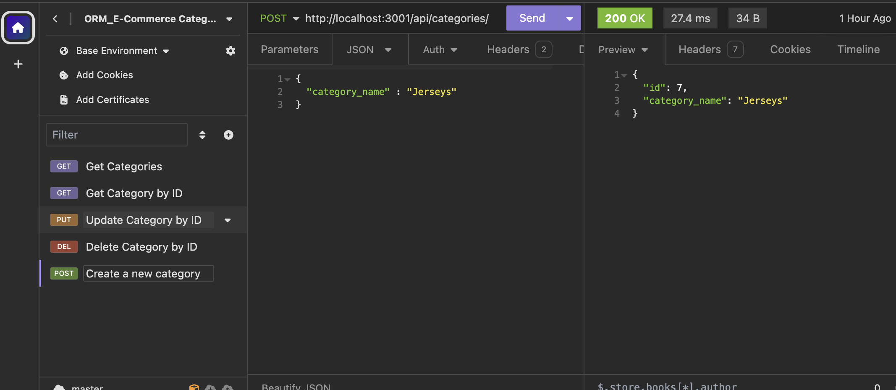
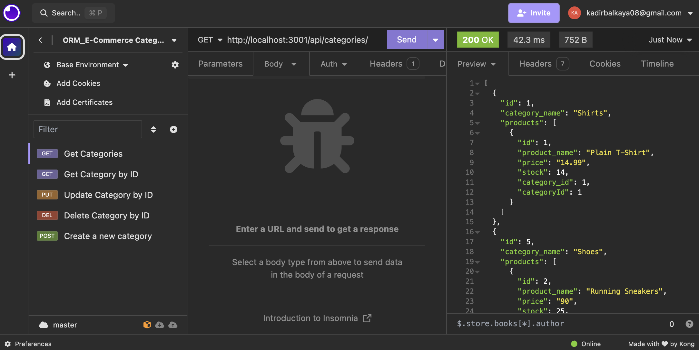
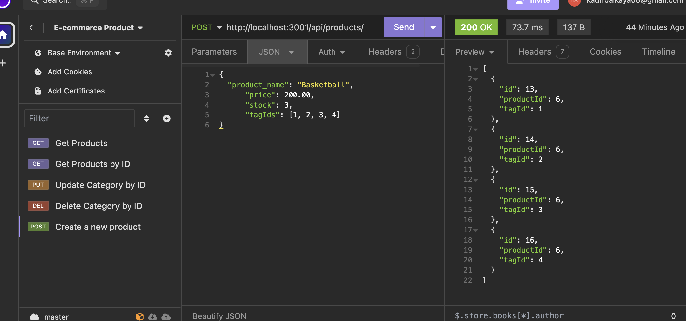
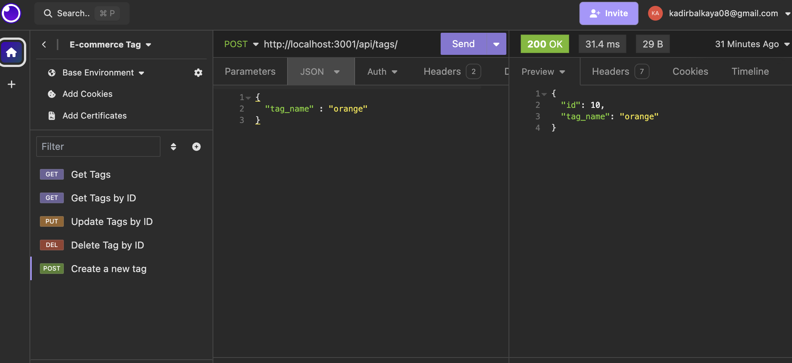

 # ORM E-commerce BackEnd

## Description

This project presents a how e-commerce website backend look like.
This project is learning purposes.What will find in js files will be simple examples of backend logic works

## Table of Contents (Optional)

If your README is long, add a table of contents to make it easy for users to find what they need.

- [Installation](#installation)
- [Usage](#usage)
- [Badges](#badges)
- [License](#license)

## Installation

1)Clone repostory to your computer 

2)Select index.js and open integrated terminal

3)Install npm modules (npm i)

4)Change .env.example , rename the file to .env and fill blanks

5)run scheme file and seeds file

7)Once you have all your dependencis type nodeindex.js

8)Then you start makin request to this routes
- [api/category/]
- [api/category/id]
- [api/products/]
- [api/products/id]
- [api/tags/]
- [api/tags/id]

## Usage

You can make request through https//localhost:3001/api/products or you can use insomnia to make request.

,

---
## Quick Demo  ##

## License

## Badges

